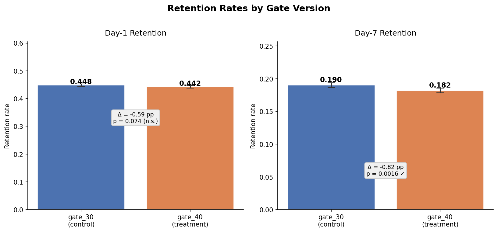
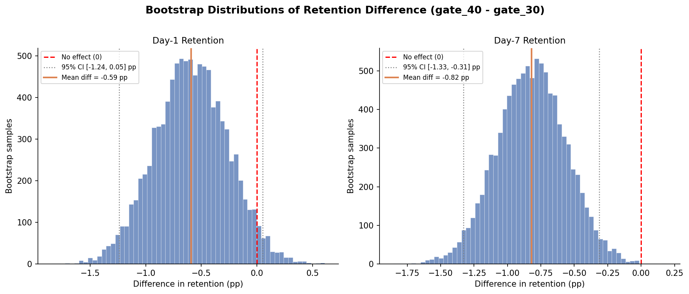
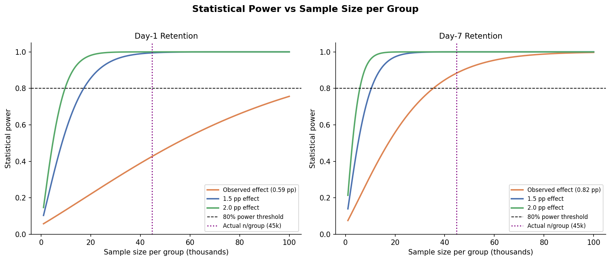
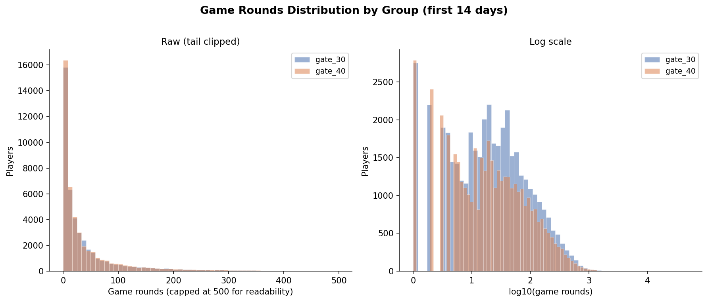

# Cookie Cats A/B Test Analysis

Does moving a mobile game's first gate from level 30 to level 40 affect player retention? This project analyzes a real A/B test from Tactile Entertainment's Cookie Cats, walking through the full experiment analysis workflow: data validation, power analysis, hypothesis testing, bootstrap robustness checks, and variance reduction with CUPED.

## Result

Moving the gate to level 40 hurt retention at both time windows. Day-7 retention dropped by 0.82 percentage points (19.0% to 18.2%, p=0.0016). Day-1 retention dropped by 0.59pp but didn't reach significance, which the power analysis explains: the test was slightly underpowered to detect an effect that small.

**Recommendation: keep the gate at level 30.**

## Figures

**Retention rates by group (with 95% CIs)**


**Bootstrap distributions of the treatment effect**


**Power curves: what effect sizes could this experiment detect?**


**Game rounds distribution by group (shows the outlier)**


## What's in the notebook

- **Data validation + SRM check** — confirmed clean data, then flagged a small sample ratio mismatch (group sizes were 44,700 vs 45,489, chi-square p=0.0086). Worth investigating in a live setting.
- **Power analysis** — retroactively computed MDEs given actual sample sizes. Shows why retention_1 didn't reach significance even though the point estimate was negative.
- **Hypothesis tests** — two-proportion z-tests on both retention windows, with 95% CIs on the difference.
- **Bootstrap cross-check** — 10,000 bootstrap iterations as a non-parametric sanity check on the z-test results. Results matched closely.
- **Outlier robustness** — one player logged 49,854 rounds in 14 days (almost certainly a bot). Confirmed excluding them doesn't change any conclusions.
- **CUPED** — implemented variance reduction using `sum_gamerounds` as a covariate, with an honest caveat: this covariate is measured over the same window as the outcomes, so it may itself be affected by treatment. Included to show the technique, not as a clean result.

## Dataset

[Cookie Cats on Kaggle](https://www.kaggle.com/datasets/yufengsui/mobile-games-ab-testing) — 90,189 players, 5 columns, no missing data.

| Column | Description |
|---|---|
| `userid` | Unique player ID |
| `version` | `gate_30` (control) or `gate_40` (treatment) |
| `sum_gamerounds` | Rounds played in first 14 days |
| `retention_1` | Did the player return on day 1? |
| `retention_7` | Did the player return on day 7? |

## How to run

```bash
git clone https://github.com/flex12397/cookie-cats-ab-test
cd cookie-cats-ab-test
pip install -r requirements.txt
jupyter notebook cookie_cats_ab_test_analysis.ipynb
```

## Skills used

Python, pandas, scipy, statsmodels, matplotlib, two-proportion z-tests, bootstrap resampling, power analysis, CUPED variance reduction, sample ratio mismatch checks
